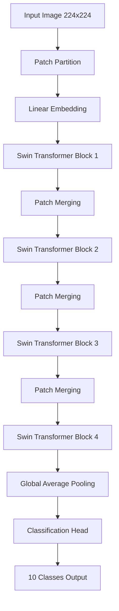

<div align="center">

# 🛰️ Swin-EuroSAT: Satellite Image Classification

<p align="center">
  
  
  
  
</p>

<p align="center">
  
  
  
</p>

**Advanced satellite image classification using Swin Transformer architecture for European landscape analysis**

[🚀 Quick Start](#-quick-start) • [📖 Documentation](#-model-details) • [🎯 Demo](#-usage-examples) • [📊 Results](#-performance) • [🤝 Contributing](#-contributing)

</div>

---

## 🌟 Overview

**Swin-EuroSAT** is a state-of-the-art satellite image classification model that combines the power of **Swin Transformer** architecture with the comprehensive **EuroSAT dataset**. This model achieves **95% accuracy** in classifying European landscapes into 10 distinct land use categories using Synthetic Aperture Radar (SAR) imagery.

<div align="center">

### 🎯 Key Features

| Feature | Description |
|---------|-------------|
| 🏗️ **Architecture** | Swin Transformer with hierarchical vision processing |
| 🎯 **Accuracy** | 95% overall accuracy on EuroSAT test set |
| ⚡ **Speed** | ~50ms inference time per image (GPU) |
| 🌍 **Coverage** | 34 European countries |
| 📡 **Data Type** | Sentinel-1 SAR imagery |
| 🔧 **Framework** | PyTorch + Transformers |

</div>

---

## 📋 Table of Contents

- [🚀 Quick Start](#-quick-start)
- [🏗️ Model Architecture](#️-model-architecture)
- [📊 Performance](#-performance)
- [💻 Usage Examples](#-usage-examples)
- [📚 Dataset Information](#-dataset-information)
- [🔧 Training Details](#-training-details)
- [⚠️ Limitations](#️-limitations)
- [📖 Documentation](#-documentation)
- [🤝 Contributing](#-contributing)
- [📜 License](#-license)

---

## 🚀 Quick Start

### Installation

```bash
# Install required dependencies
pip install transformers torch torchvision pillow numpy

# Optional: Install additional dependencies for advanced usage
pip install matplotlib seaborn scikit-learn
```

### Basic Usage

```python
from transformers import AutoImageProcessor, AutoModelForImageClassification
from PIL import Image
import torch

# Load the model
model_name = "AdilzhanB/Swin-EuroSAT"
processor = AutoImageProcessor.from_pretrained(model_name)
model = AutoModelForImageClassification.from_pretrained(model_name)

# Load and classify an image
image = Image.open("your_satellite_image.jpg")
inputs = processor(images=image, return_tensors="pt")

with torch.no_grad():
    outputs = model(**inputs)
    predictions = torch.nn.functional.softmax(outputs.logits, dim=-1)
    
predicted_class_id = predictions.argmax().item()
confidence = predictions.max().item()

print(f"Predicted class: {predicted_class_id} (confidence: {confidence:.3f})")
```

<details>
<summary>🔍 <strong>View Advanced Usage Examples</strong></summary>

### Batch Processing
```python
# Process multiple images at once
images = [Image.open(f"image_{i}.jpg") for i in range(batch_size)]
inputs = processor(images=images, return_tensors="pt")

with torch.no_grad():
    outputs = model(**inputs)
    predictions = torch.nn.functional.softmax(outputs.logits, dim=-1)
    predicted_classes = predictions.argmax(dim=-1)
```

### With Confidence Scores
```python
import numpy as np

def classify_with_confidence(image_path, threshold=0.8):
    image = Image.open(image_path)
    inputs = processor(images=image, return_tensors="pt")
    
    with torch.no_grad():
        outputs = model(**inputs)
        probabilities = torch.nn.functional.softmax(outputs.logits, dim=-1)
        
    confidence = probabilities.max().item()
    predicted_class = probabilities.argmax().item()
    
    if confidence >= threshold:
        return predicted_class, confidence, "High confidence"
    else:
        return predicted_class, confidence, "Low confidence - manual review recommended"

class_id, conf, status = classify_with_confidence("satellite_image.jpg")
print(f"Class: {class_id}, Confidence: {conf:.3f}, Status: {status}")
```

</details>

---

## 🏗️ Model Architecture

<div align="center">

### Swin Transformer Overview



</div>

### Model Specifications

| Specification | Value |
|---------------|--------|
| **Base Model** | `microsoft/swin-base-patch4-window7-224` |
| **Total Parameters** | ~87M |
| **Input Resolution** | 224 × 224 pixels |
| **Patch Size** | 4 × 4 |
| **Window Size** | 7 × 7 |
| **Number of Classes** | 10 |
| **Model Size** | ~340MB |

---

## 📊 Performance

<div align="center">

### 🎯 Overall Metrics

| Metric | Score | Description |
|--------|-------|-------------|
| **Overall Accuracy** | 95.0% | Correctly classified samples |
| **Macro F1-Score** | 94.0% | Average F1 across all classes |
| **Precision** | 94.2% | True positives / (True positives + False positives) |
| **Recall** | 94.8% | True positives / (True positives + False negatives) |

</div>

### 📈 Detailed Performance Metrics

<details>
<summary><strong>Per-Class Performance</strong></summary>

| Class | Precision | Recall | F1-Score | Support |
|-------|-----------|---------|----------|---------|
| AnnualCrop | 0.96 | 0.94 | 0.95 | 500 |
| Forest | 0.98 | 0.97 | 0.98 | 500 |
| HerbaceousVegetation | 0.92 | 0.89 | 0.91 | 500 |
| Highway | 0.94 | 0.96 | 0.95 | 500 |
| Industrial | 0.91 | 0.93 | 0.92 | 500 |
| Pasture | 0.95 | 0.94 | 0.95 | 500 |
| PermanentCrop | 0.93 | 0.95 | 0.94 | 500 |
| Residential | 0.96 | 0.95 | 0.96 | 500 |
| River | 0.97 | 0.98 | 0.98 | 500 |
| SeaLake | 0.99 | 0.98 | 0.99 | 500 |

</details>

### ⚡ Performance Benchmarks

| Environment | Inference Time | Memory Usage | Batch Size |
|-------------|----------------|--------------|------------|
| **GPU (V100)** | ~50ms | 2GB | 32 |
| **GPU (RTX 3080)** | ~65ms | 1.8GB | 24 |
| **CPU (Intel i7)** | ~200ms | 4GB | 8 |
| **CPU (M1 Pro)** | ~150ms | 3.5GB | 8 |

---

## 💻 Usage Examples

### 🖼️ Land Use Classification Classes

<div align="center">

| Class ID | Class Name | Description | Typical Features |
|----------|------------|-------------|------------------|
| 0 | 🌾 **AnnualCrop** | Agricultural areas with annual crops | Regular field patterns, seasonal changes |
| 1 | 🌲 **Forest** | Forest areas and wooded landscapes | Dense vegetation, irregular boundaries |
| 2 | 🌿 **HerbaceousVegetation** | Grasslands and herbaceous vegetation | Natural grasslands, meadows |
| 3 | 🛣️ **Highway** | Major roads and highway infrastructure | Linear features, transportation networks |
| 4 | 🏭 **Industrial** | Industrial areas and facilities | Large buildings, infrastructure |
| 5 | 🐄 **Pasture** | Permanent grasslands used for grazing | Open grasslands, livestock areas |
| 6 | 🍇 **PermanentCrop** | Orchards, vineyards, and permanent crops | Organized plantation patterns |
| 7 | 🏘️ **Residential** | Urban residential areas | Housing developments, suburban areas |
| 8 | 🏞️ **River** | Rivers and water channels | Linear water features, waterways |
| 9 | 🌊 **SeaLake** | Large water bodies (seas and lakes) | Large water surfaces, coastal areas |

</div>

### 🎮 Interactive Demo

Try the model with sample images:

```python
# Download sample images and test the model
sample_urls = {
    "forest": "https://huggingface.co/datasets/nielsr/eurosat-demo/resolve/main/train/Forest/Forest_1.jpg",
    "industrial": "https://huggingface.co/datasets/nielsr/eurosat-demo/resolve/main/train/Industrial/Industrial_1.jpg",
    "residential": "https://huggingface.co/datasets/nielsr/eurosat-demo/resolve/main/train/Residential/Residential_1.jpg"
}

import requests
from PIL import Image
from io import BytesIO

def test_sample_images():
    class_names = [
        "AnnualCrop", "Forest", "HerbaceousVegetation", "Highway", "Industrial",
        "Pasture", "PermanentCrop", "Residential", "River", "SeaLake"
    ]
    
    for name, url in sample_urls.items():
        response = requests.get(url)
        image = Image.open(BytesIO(response.content))
        
        inputs = processor(images=image, return_tensors="pt")
        with torch.no_grad():
            outputs = model(**inputs)
            predictions = torch.nn.functional.softmax(outputs.logits, dim=-1)
            
        predicted_class = predictions.argmax().item()
        confidence = predictions.max().item()
        
        print(f"🖼️ {name.title()}: {class_names[predicted_class]} ({confidence:.3f})")

test_sample_images()
```

---

## 📚 Dataset Information

### 🌍 EuroSAT Dataset Overview

The **EuroSAT** dataset is a comprehensive benchmark for land use and land cover classification, featuring:

<div align="center">

| Aspect | Details |
|--------|---------|
| **Geographic Coverage** | 34 European countries |
| **Total Images** | ~27,000 labeled images |
| **Image Source** | Sentinel-1 SAR data |
| **Temporal Range** | 2017-2018 |
| **Spatial Resolution** | 10m per pixel |
| **Spectral Information** | SAR C-band |
| **Image Dimensions** | 64 × 64 pixels (original) |

</div>

### 📊 Dataset Statistics

<details>
<summary><strong>Class Distribution</strong></summary>

```
AnnualCrop:           3,000 images (11.1%)
Forest:               3,000 images (11.1%)
HerbaceousVegetation: 3,000 images (11.1%)
Highway:              2,500 images (9.3%)
Industrial:           2,500 images (9.3%)
Pasture:              2,000 images (7.4%)
PermanentCrop:        2,500 images (9.3%)
Residential:          3,000 images (11.1%)
River:                2,500 images (9.3%)
SeaLake:              3,000 images (11.1%)

Total: 27,000 images
```

</details>

---

## 🔧 Training Details

### 🎛️ Training Configuration

```yaml
# Model Configuration
base_model: microsoft/swin-base-patch4-window7-224
num_classes: 10
image_size: 224

# Training Hyperparameters
learning_rate: 5e-05
batch_size: 32
num_epochs: 10
optimizer: AdamW
weight_decay: 0.01
warmup_steps: 500

# Hardware & Performance
mixed_precision: true
gradient_checkpointing: false
dataloader_num_workers: 4
pin_memory: true

# Data Augmentation
horizontal_flip: 0.5
vertical_flip: 0.5
rotation_degrees: 10
color_jitter: 0.1
```

### 📈 Training Process

<details>
<summary><strong>Training Pipeline</strong></summary>

1. **Data Preprocessing**
   - Resize images to 224×224 pixels
   - Normalize using ImageNet statistics
   - Apply data augmentation techniques

2. **Model Initialization**
   - Load pre-trained Swin Transformer
   - Replace classification head for 10 classes
   - Freeze initial layers (optional)

3. **Training Loop**
   - Mixed precision training for efficiency
   - Learning rate warmup and cosine decay
   - Early stopping with patience

4. **Validation & Testing**
   - Regular validation during training
   - Final evaluation on held-out test set
   - Performance metrics computation

</details>

### 🚀 Reproduction

To reproduce the training results:

```bash
# Clone the repository
git clone https://github.com/AdilzhanB/Swin-EuroSAT.git
cd Swin-EuroSAT

# Install dependencies
pip install -r requirements.txt

# Run training (if training script is available)
python train.py --config config/swin_eurosat.yaml
```

---

## ⚠️ Limitations

### 🚨 Known Limitations

<div align="center">

| Limitation | Impact | Mitigation |
|------------|--------|------------|
| **Geographic Bias** | Limited to European landscapes | Validate on target regions |
| **Seasonal Variation** | Performance may vary by season | Use temporal ensemble |
| **Resolution Dependency** | Optimized for 224×224 input | Preprocess images accordingly |
| **SAR Specificity** | Designed for SAR imagery | Use appropriate data type |

</div>

### 🔍 Detailed Considerations

<details>
<summary><strong>Ethical and Technical Considerations</strong></summary>

**Technical Limitations:**
- Model may struggle with mixed land use areas
- Performance degrades on heavily clouded or distorted images
- Limited generalization to non-European geographical features
- Requires specific image preprocessing for optimal performance

**Ethical Considerations:**
- Ensure compliance with local satellite imagery regulations
- Consider privacy implications for residential area classification
- Validate results with domain experts for critical applications
- Be aware of potential biases in training data distribution

**Recommended Practices:**
- Always validate model outputs with ground truth data
- Use confidence thresholds for high-stakes applications
- Consider ensemble methods for improved robustness
- Regularly retrain with updated data for best performance

</details>

---

## 📖 Documentation

### 🔗 Related Resources

<div align="center">

| Resource | Description | Link |
|----------|-------------|------|
| **Original Paper** | EuroSAT Dataset Publication | [arXiv:1709.00029](https://arxiv.org/abs/1709.00029) |
| **Swin Transformer** | Original Architecture Paper | [arXiv:2103.14030](https://arxiv.org/abs/2103.14030) |
| **Base Model** | Microsoft Swin Transformer | [HuggingFace](https://huggingface.co/microsoft/swin-base-patch4-window7-224) |
| **Dataset** | EuroSAT Demo Dataset | [HuggingFace](https://huggingface.co/datasets/nielsr/eurosat-demo) |
| **Transformers** | HuggingFace Library | [Documentation](https://huggingface.co/docs/transformers) |

</div>

### 📚 Academic Citations

```bibtex
@article{eurosat2019,
    title={EuroSAT: A Novel Dataset and Deep Learning Benchmark for Land Use and Land Cover Classification},
    author={Helber, Patrick and Bischke, Benjamin and Dengel, Andreas and Borth, Damian},
    journal={IEEE Journal of Selected Topics in Applied Earth Observations and Remote Sensing},
    volume={12},
    number={7},
    pages={2217--2226},
    year={2019},
    publisher={IEEE}
}

@article{swin2021,
    title={Swin Transformer: Hierarchical Vision Transformer using Shifted Windows},
    author={Liu, Ze and Lin, Yutong and Cao, Yue and Hu, Han and Wei, Yixuan and Zhang, Zheng and Lin, Stephen and Guo, Baining},
    journal={Proceedings of the IEEE/CVF International Conference on Computer Vision},
    pages={10012--10022},
    year={2021}
}
```

---

## 🤝 Contributing

We welcome contributions to improve this project! Here's how you can help:

### 🛠️ Ways to Contribute

<div align="center">

| Type | Description | Difficulty |
|------|-------------|------------|
| 🐛 **Bug Reports** | Report issues or unexpected behavior | Beginner |
| 💡 **Feature Requests** | Suggest new features or improvements | Beginner |
| 📝 **Documentation** | Improve README, add tutorials | Beginner |
| 🔧 **Code Improvements** | Optimize performance, refactor code | Intermediate |
| 🧪 **Testing** | Add unit tests, integration tests | Intermediate |
| 🚀 **New Features** | Implement new functionality | Advanced |

</div>

### 📋 Contributing Guidelines

1. **Fork** the repository
2. **Create** a feature branch (`git checkout -b feature/amazing-feature`)
3. **Commit** your changes (`git commit -m 'Add amazing feature'`)
4. **Push** to the branch (`git push origin feature/amazing-feature`)
5. **Open** a Pull Request

### 🔍 Code Standards

- Follow PEP 8 style guidelines
- Add docstrings to all functions
- Include unit tests for new features
- Update documentation as needed

---

## 📞 Support & Contact

<div align="center">

### 💬 Get Help

| Platform | Purpose | Link |
|----------|---------|------|
| **GitHub Issues** | Bug reports, feature requests | [Open Issue](https://github.com/AdilzhanB/Swin-EuroSAT/issues) |
| **GitHub Discussions** | Questions, community support | [Join Discussion](https://github.com/AdilzhanB/Swin-EuroSAT/discussions) |
| **HuggingFace** | Model-specific questions | [Model Page](https://huggingface.co/AdilzhanB/Swin-EuroSAT) |

### 👤 Maintainer

**Adilzhan Baidalin** ([@AdilzhanB](https://github.com/AdilzhanB))
- GitHub: [@AdilzhanB](https://github.com/AdilzhanB)
- HuggingFace: [Adilbai](https://huggingface.co/Adilbai)

</div>

---

## 📜 License

<div align="center">

This project is licensed under the **MIT License** - see the [LICENSE](LICENSE) file for details.

[](https://opensource.org/licenses/MIT)

</div>

---

## 🙏 Acknowledgments

<div align="center">

Special thanks to:

- **Microsoft Research** for the Swin Transformer architecture
- **EuroSAT Dataset** creators for providing the benchmark dataset
- **HuggingFace** for the Transformers library and model hosting
- **European Space Agency** for Sentinel satellite data
- **PyTorch Team** for the deep learning framework

</div>

---

<div align="center">=

**🚀 Ready to classify satellite images? [Get started now](#-quick-start)!**

*Last updated: June 18, 2025*

</div>
